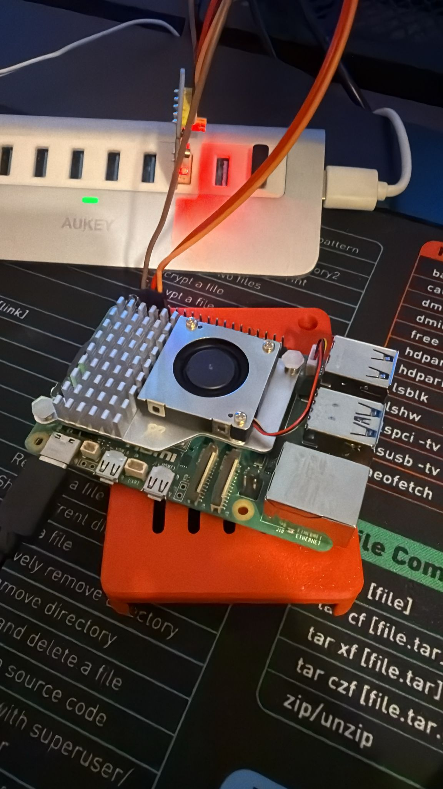
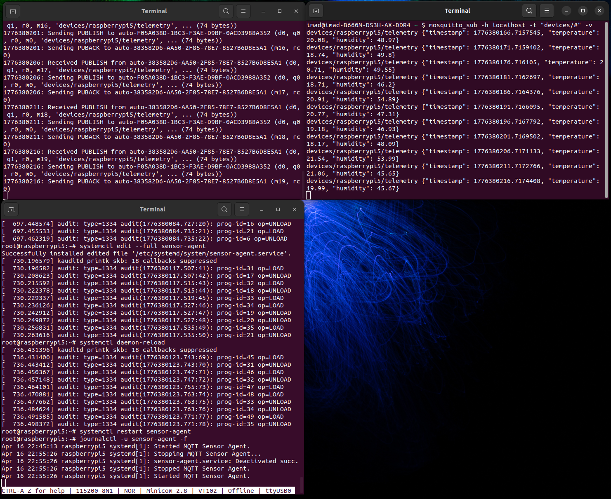

<p align="center">
  
</p>

<h1 align="center">Yocto IoT Demo — Custom Linux for Raspberry Pi 5</h1>

<p align="center">
  <strong>End-to-end embedded Linux distribution with MQTT telemetry, Wi-Fi provisioning, and OTA update infrastructure</strong>
</p>

<p align="center">
  
  
  
  
  
  
</p>

---

## 🎯 Project Brief

This project delivers a **production-grade, custom Linux distribution** for the Raspberry Pi 5 using the Yocto Project. It was built from scratch — from BSP integration to application-layer services — to demonstrate a realistic IoT gateway scenario:

> **A headless embedded device that boots, connects to Wi-Fi autonomously, reads sensor data, and publishes JSON telemetry to an MQTT broker — with an OTA update path ready for field deployment.**

This is not a pre-built image with packages bolted on. Every layer, recipe, distro configuration, and systemd service was written and integrated by hand.

---

## 📸 Live Result

<p align="center">
  
</p>
<p align="center"><em>Successful boot & runtime verification on physical Raspberry Pi 5 hardware</em></p>

---

## ✅ Delivered & Verified

| # | Deliverable | Details |
|:-:|---|---|
| 1 | **Custom Yocto distro** | `iotdemo` distro based on Poky — systemd init, headless, no X11/Wayland — boots on RPi 5 |
| 2 | **Custom BSP layer** | `meta-iotdemo` — fully versioned in Git, clean layer structure, Scarthgap-compatible |
| 3 | **MQTT sensor agent** | Python 3 daemon publishing temperature/humidity JSON to MQTT over configurable topics |
| 4 | **systemd integration** | Sensor agent runs as a managed service — auto-start, restart-on-failure, journal logging |
| 5 | **Kernel Wi-Fi configuration** | `brcmfmac` module enabled via `.cfg` kernel fragment in a `bbappend` |
| 6 | **Auto Wi-Fi at boot** | `wpa_supplicant` + firmware provisioned in-image — network up before first user login |
| 7 | **End-to-end MQTT verified** | JSON payloads confirmed on the broker — full data pipeline validated on hardware |
| 8 | **Reproducible build** | Single `kas build kas/iotdemo-rpi5.yml` command — deterministic, CI-ready |
| 9 | **OTA update infrastructure** | RAUC integrated with certificate scaffolding — ready for A/B update bundles |

---

## 🛠️ Technical Stack

```
┌──────────────────────────────────────────────────────────────┐
│                      BUILD SYSTEM                            │
│  Yocto Scarthgap  ·  BitBake  ·  KAS                        │
├──────────────────────────────────────────────────────────────┤
│                       LAYERS                                 │
│  poky (meta + meta-poky)                                     │
│  meta-raspberrypi          — BSP for RPi 5                   │
│  meta-openembedded         — meta-oe, meta-python, meta-net  │
│  meta-rauc                 — OTA update framework            │
│  meta-iotdemo              — Custom project layer ★          │
├──────────────────────────────────────────────────────────────┤
│                    DISTRIBUTION                              │
│  iotdemo v1.0                                                │
│  Init: systemd  ·  Network: wpa_supplicant + systemd-networkd│
│  Features: usrmerge, IPv4/IPv6, WiFi, RAUC                  │
│  Removed: x11, wayland, opengl                               │
├──────────────────────────────────────────────────────────────┤
│                    APPLICATION                               │
│  sensor-agent.py → MQTT (paho) → JSON telemetry              │
│  systemd service  ·  Configurable via env vars               │
├──────────────────────────────────────────────────────────────┤
│                     HARDWARE                                 │
│  Raspberry Pi 5  ·  BCM43455 WiFi  ·  UART serial console    │
└──────────────────────────────────────────────────────────────┘
```

---

## 🏗️ Project Structure

```
yocto-iotdemo/
├── kas/
│   └── iotdemo-rpi5.yml              # One-command build configuration
│
├── meta-iotdemo/                     # ★ Custom Yocto layer
│   ├── conf/
│   │   ├── layer.conf                # Layer priority 10, scarthgap compat
│   │   └── distro/iotdemo.conf       # Custom distribution definition
│   ├── recipes-images/
│   │   └── iotdemo-image.bb          # Image recipe (extends core-image-minimal)
│   ├── recipes-iot/
│   │   └── sensor-agent/             # Python MQTT agent + systemd service
│   │       ├── sensor-agent.bb
│   │       └── files/
│   │           ├── sensor-agent.py
│   │           └── sensor-agent.service
│   ├── recipes-connectivity/
│   │   └── wpa-supplicant-config/    # WiFi credentials provisioning
│   ├── recipes-kernel/
│   │   └── linux/                    # Kernel bbappend + brcmfmac.cfg fragment
│   └── recipes-rauc/
│       └── rauc-certificates/        # OTA signing certificate scaffolding
│
├── poky/                             # Yocto reference (Scarthgap)
├── meta-raspberrypi/                 # RPi BSP layer
├── meta-openembedded/                # OE community layers
└── meta-rauc/                        # RAUC OTA framework
```

---

## 📡 Sensor Agent — MQTT Telemetry

The `sensor-agent` is a Python 3 daemon that publishes IoT telemetry data over MQTT:

```
┌──────────────┐       MQTT (QoS 1)       ┌──────────────┐
│  RPi 5       │  ──────────────────────►  │  MQTT Broker │
│  sensor-agent│   Topic:                  │  (Mosquitto) │
│  (systemd)   │   devices/<host>/telemetry│              │
└──────────────┘                           └──────────────┘
```

**Payload format:**
```json
{
  "timestamp": 1744844400.123,
  "temperature": 21.47,
  "humidity": 48.93
}
```

**Configuration** via environment variables — no rebuild required:

| Variable | Default | Description |
|---|---|---|
| `MQTT_BROKER` | `localhost` | Broker hostname or IP |
| `MQTT_PORT` | `1883` | Broker port |
| `MQTT_TOPIC` | `devices/<hostname>/telemetry` | Publish topic |

---

## ⚡ Quick Start

```bash
# 1. Clone
git clone <repo-url> yocto-iotdemo && cd yocto-iotdemo

# 2. Build (single command — KAS handles everything)
kas build kas/iotdemo-rpi5.yml

# 3. Flash
sudo dd if=build/tmp/deploy/images/raspberrypi5/iotdemo-image-raspberrypi5.wic.xz \
    of=/dev/sdX bs=4M status=progress conv=fsync iflag=fullblock

# 4. Boot → WiFi connects → sensor-agent starts → MQTT publishing begins
```

**Requirements:** Linux host · `pip install kas` · 50 GB+ disk · 8 GB+ RAM

---

## 🔐 OTA Updates (RAUC)

The image includes [RAUC](https://rauc.io/) for secure, atomic A/B firmware updates:

- Certificate-based bundle authentication
- Atomic slot switching — no bricked devices
- Ready for integration with [hawkBit](https://www.eclipse.org/hawkbit/) or custom update server

> Certificate scaffolding is included. Production deployments should replace with a proper PKI chain.

---

## 📦 Image Contents

| Package | Role |
|---|---|
| `openssh` | Remote SSH access |
| `python3` + `paho-mqtt` | Sensor agent runtime |
| `sensor-agent` | Custom MQTT telemetry daemon |
| `rauc` | OTA update client |
| `wpa-supplicant` | Wi-Fi authentication |
| `linux-firmware-rpidistro-bcm43455` | RPi 5 Wi-Fi firmware |
| `bluez-firmware-rpidistro` | Bluetooth firmware |
| `kernel-module-brcmfmac` | Wi-Fi kernel driver |

---

## 🗺️ Roadmap

- [ ] Integrate real DHT11/DHT22 hardware sensor driver
- [ ] Automated RAUC bundle generation in the build pipeline
- [ ] Grafana / Node-RED telemetry dashboard
- [ ] GitHub Actions CI/CD for automated image builds
- [ ] MQTT over TLS with client certificates
- [ ] Read-only rootfs with persistent data partition

---

<p align="center">
  <sub>Built with <a href="https://www.yoctoproject.org/">Yocto Project</a> Scarthgap — Raspberry Pi 5 — MIT License</sub>
</p>
